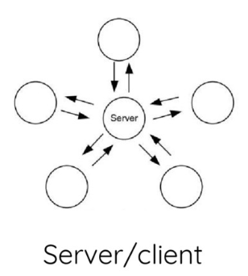

>a procedure or process of computer peer-to-peer communication that is based on the way that epidemics spread. 
<a href="https://en.wikipedia.org/wiki/Gossip_protocol">Gossip Protocol, Wikipedia, 2018</a>

Used by Bitcoin and Hyperledger, the Gossip protocol is part of the integral tech stack that makes the blockchain each of these solutions use work. 

The key elements in a blockchain are public-key cryptography (identity), gossip protocol (networking), and proof-of-work (consensus). 

Moving away from centralized data storage, gossip provides a means to move from this means of centralized client/server communication: 

Source: <a href="https://speakerdeck.com/haseebq/lets-build-a-blockchain-a-mini-cryptocurrency-in-ruby?slide=18">Haseeb Qureshi
2017</a>

to this decentralized peer-to-peer communication: 

Source: <a href="https://speakerdeck.com/haseebq/lets-build-a-blockchain-a-mini-cryptocurrency-in-ruby?slide=18">Haseeb Qureshi
 2017</a>

## How does a gossip protocol work?

There are three types of gossip protocols: push, pull, and hybrid push-pull protocols. 

### The Push Gossip Protocol

The push gossip protocol involves one message being sent to more than two other nodes until the whole network of nodes has received the message. Once a node has received a message, it passes them on to two uninfected nodes, who then become infected and send the message to two more nodes until the whole network has received the message.

### The Pull Gossip Protocol

The pull gossip protocol involves queries being sent to other nodes to see if they have any updated messages from them since the last gossip message. If so, then that node receives the updated message. If not, then the node remains the same. 

### Hybrid Push-Pull Gossip Protocol

There are various combinations of both push and pull gossip protocols that utilize both push and pull to keep the network up to date on all the messages sent. 

### Rules of Gossip Protocols

Rules can be built on top of gossip protocols that ensure the veracity of each message. "Let's say if a network obeying gossip protocol holds a rule that when two-thirds of the nodes return the same information, that information will be considered as the truth. In this process, all the nodes are treated equally. It does not matter if a node is more powerful than its peers. The only thing that matters here is the network bandwidth." (Source: <a href="https://www.quora.com/What-is-a-Gossip-protocol">What is a Gossip protocol - Quora?</a>)

## Conclusion

Now, you know what a gossip protocol does, types of gossip protocols, and rules that can be written on top of gossip protocols. There is still more to explore with gossip protocols. Mainly, there is a gossip analysis available through Coursera that analyzes the runtimes of these various types of gossip protocols, <a href="https://www.coursera.org/lecture/cloud-computing/1-3-gossip-analysis-jjieX">1.3 Gossip Analysis - Cloud Computing - Coursera</a>

Sources for article: 
- <a href="https://www.coursera.org/lecture/cloud-computing/1-2-the-gossip-protocol-5AOex">Cloud Computing Gossip Protocol Coursera Course</a>
- 
- <a href="https://speakerdeck.com/haseebq/lets-build-a-blockchain-a-mini-cryptocurrency-in-ruby?slide=18">Haseeb Qureshi 2017</a>
- <a href="https://www.coursera.org/lecture/cloud-computing/1-3-gossip-analysis-jjieX">1.3 Gossip Analysis - Cloud Computing - Coursera</a