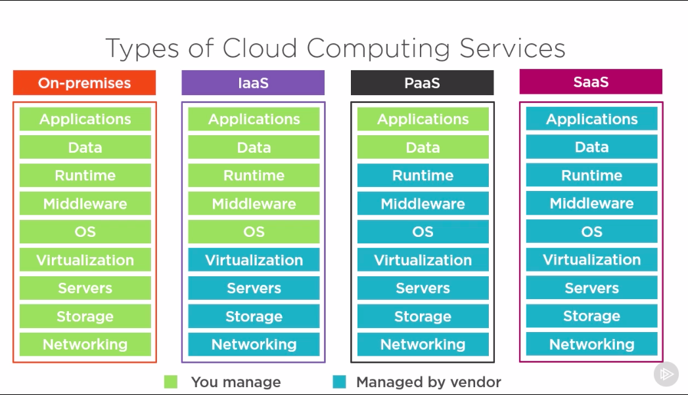
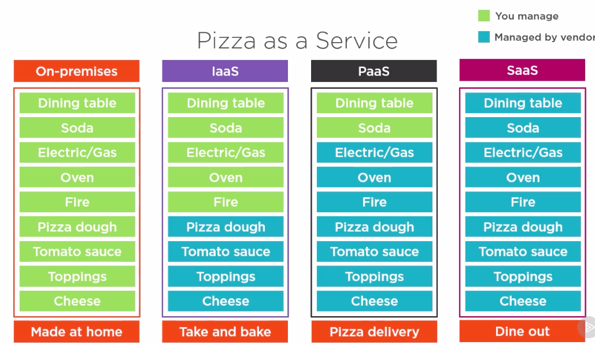

In the "Introduction to Cloud Computing" lecture as part of the Computer Fundamentals: Virtualization and Cloud Computing course on <a href="https://app.pluralsight.com/player?course=computer-fundamentals-virtualization-cloud-computing&author=vlad-catrinescu&name=1dece36d-7c2b-44c9-b664-ef21feff5171&clip=2&mode=live">PluralSight</a>, Vlad, the instructor, goes over the basic differences between IaaS, PaaS, and SaaS by comparing them each to the process of making pizza. This post will paraphrase the differences explained by Vlad between all these different types of cloud computing environments. 

Here is the difference between IaaS and PaaS and SaaS as explained by Vlad. 

You have the option of making it all yourself, providing your own hardware, etc. You have complete control over the applications, data, runtime, middleware, operating system, virtualization, servers, storage, and networking. 

With IaaS, you manage only the applications, data, runtime, middleware, and operating system, while the cloud provider manages the virtualization, servers, storage, and networking. 

With PaaS, you manage only teh applications and the data, while the cloud provider manages the rest. 

With SaaS, you manage nothing. The cloud provider manages the application, data, runtime, middleware, etc. 

Here is an infographic that Vlad made for showing the differences clearly: 

As related to pizza, everyone's favorite food, you have the option of doing it yourself, take and bake, pizza delivery, and eating pizza at a pizza restaurant. 

Doing it yourself is like making pizza at home. You have all the ingredients. You have the oven. You have the baking pan. You can make pizza yourself. 

Infrastructure as a Service is like cooking the pizza in someone else's oven and baking it. 

Platform as a Service is like pizza delivery. 

Software as a Service is like eating pizza at a pizza restaurant. 

It can be visualized in the diagram below: 

Now, you know the differences between IaaS, PaaS, and SaaS! Congratulations!

