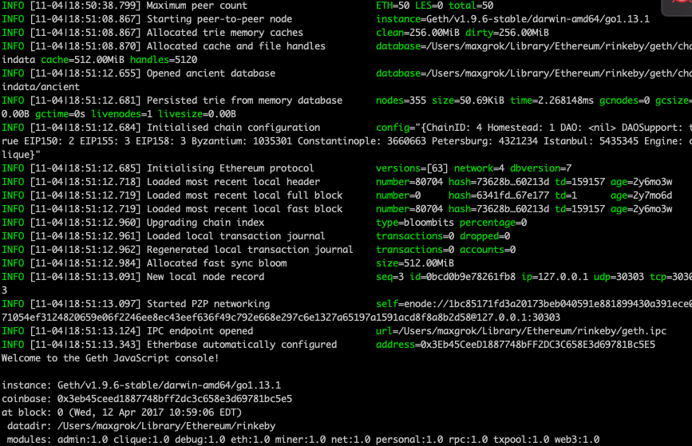
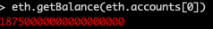

## Install Geth (for Mac OS X)

Run the following commands: <br/>
`brew tap ethereum/ethereum`<br/>
`brew install ethereum`<br/>

## Run the Rinkeby network with Geth
Run this command to start geth on the rinkeby network:
`geth --rinkeby --syncmode fast console`

You should see something like the following: 


Followed by: 
.png)

## Create a new Account 

Run the following to create a new account: 
`personal.newAccount()` within the Geth CLI. <br/>
Enter a password and confirm it. 

## Post your Account Address on Social Media

Include your address on Twitter post. <br/>

Copy and paste the url to your Twitter post into the faucet page. 
<a href="https://faucet.rinkeby.io/">Faucet Page</a><br/>

Pick an amount of test Ether you want and wait 2-3 minutes for the account to be funded. <br/>

## Exit out of Rinkeby Fast Console && Start a Light Console

Exit out of the Rinkeby Fast console that is open. <br/>

Run the following in the CLI: <br/>
`geth --rinkeby --syncmode light console`<br/>

## Check Your Ether Account Balance

Run `eth.getBalance(eth.accounts[0])` within the Geth CLI. 

You should see the following (corresponding with how much Ether you picked):



## Potential Error

```js
Error: no suitable peers available at 
  web3.js:3143:20
  at web3.js:6347:15
  at web3.js:5081:36
  at anonymous:1:1
  ```

Try adding a peer to your node with this command:
```
admin.addPeer("enode://05b03241bae2a17534a4ffa005d075e38868f89c6db95b0e089c67ff6d3e9ed3f7132d4e9d57f09628f4827cfb370fe5f624c36af44899e423aacf4869a3adf3@13.124.4.106:30303");
```

Reference <a href="https://gist.github.com/rfikki/e2a8c47f4460668557b1e3ec8bae9c11">Gist</a>.

## SUCCESS!

Congratulations! You have added test ether via the Rinkeby Faucet with an account you made with Geth! 

