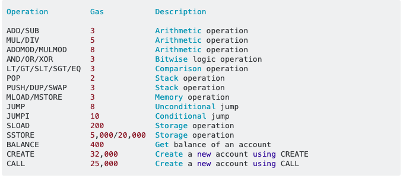

## Assumptions for the Post

Presumptions in this post: You know what gas is in Ethereum. You know a bit of Solidity (i.e. what a struct is).

If you do not, then I'd recommend going through <a href="https://cryptozombies.io/en/course/">CryptoZombies tutorials</a> atleast until finishing the Advanced Solidity tutorial (lesson 3) and up to Chapter 4, entitled "Gas". 
It will explain to you the basics of Solidity and what gas is in relation to smart contracts in a fun, succinct way. 

## Strategies for Saving/Optimizing Gas

There are several strategies for saving and optimizing gas utility with Solidity smart contracts. I'm going to go over all of the ones I could find with a variety of sources like struct packing, variable packing, and more. 

Why does saving gas do? It allows you to spend less ETH/money executing smart contracts that you write and deploy to the Ethereum mainnet. 

## What costs Gas? 

For information on what exactly costs gas, please look at the <a href="https://docs.google.com/spreadsheets/d/1n6mRqkBz3iWcOlRem_mO09GtSKEKrAsfO7Frgx18pNU/edit#gid=0">Yellow Paper Excel Breakdown of Gas Costs by Opcode</a>. This paper breaks down exact gas costs by operation code such as ADD for addition and SUB for subtraction. Each opcode corresponds to an operation that you can execute in a Solidity smart contract.  

Here is a sample of what costs gas by opcode:

 (Source: <a href="https://ethereum.stackexchange.com/questions/28813/how-to-write-an-optimized-gas-cost-smart-contract">Stackexchange</a>)

All prices are in wei.

For a frame of reference for how much this actually is in ETH, please visit this <a href="https://eth-converter.com/">ETH converter</a>. 
# Strategies you can use to save gas:

## (1) Use fixed arrays instead of dynamic arrays ( <a href="https://ethereum.stackexchange.com/questions/28813/how-to-write-an-optimized-gas-cost-smart-contract">Stackexchange</a>)


## (2) Structs packing to save gas (Source: CryptoZombies)

Inside structs, smaller unsigned integers,like uint32, will save you gas and allow Solidity to store these variables together in less space. 

```js
struct NormalStruct {
  uint a;
  uint b;
  uint c;
}

struct MiniMe {
  uint32 a;
  uint32 b;
  uint c;
}

// `mini` will cost less gas than `normal` because of struct packing
NormalStruct normal = NormalStruct(10, 20, 30);
MiniMe mini = MiniMe(10, 20, 30); 
```
(Code source: <a href="https://cryptozombies.io/en/lesson/3/chapter/4">CryptoZombies Lesson 3: Advanced Solidity: Chapter 4: Gas</a>)

## (3) Variable Packing (Source: Will Shahda)

  ### only occurs in storage. memory and call data will not be packed. 

## (4) Inheritance (Source: Will Shahda)

## (5) Initialization of variables (Source: Will Shahda)

## (6) Deletion (Source: Will Shahda)

## (7) Storing data in events (Source: Will Shahda)

## (8) Use Assembly Code (Source: Julien Klepatch)

## (9) Turn on the Solidity optimizer (Source: Julien Klepatch)

## (10) Write literal values instead of computed ones (Source: Julien Klepatch)

## Conclusion

There are a variety of methods that can be used to save and optimize gas usage in Solidity smart contracts. Hopefully, this post has given you a synthesis of all the strategies available right now and the knowledge to be able to implement them as well.  

## Sources/Further Reading on Optimizing Gas: 

<a href="http://www.cryptozombies.io/en/course">CryptoZombies by LOOM network</a>

<a href="https://medium.com/coinmonks/gas-optimization-in-solidity-part-i-variables-9d5775e43dde">Gas Optimization in Solidity Part I: Variables by Will Shahda</a>

<a href="https://ethereum.stackexchange.com/questions/28813/how-to-write-an-optimized-gas-cost-smart-contract">How to Write An Optimized Gas Cost Smart Contract? - Stackexchange </a>

<a href="https://eattheblocks.com/how-to-optimize-gas-cost-in-a-solidity-smart-contract-6-tips/">How to optimize gas cost in a Solidity smart contract? 6 tips by Julien Klepatch</a>

<a href="https://blog.polymath.network/solidity-tips-and-tricks-to-save-gas-and-reduce-bytecode-size-c44580b218e6">Solidity tips and tricks to save gas and reduce bytecode size by Mudit Gupta</a><br/>

<a href="https://danielszego.blogspot.com/2018/01/solidity-gas-optimization-storage-and.html">Solidity Gas Optimization - storage and local variables of basic types</a>

<a href="https://mudit.blog/solidity-gas-optimization-tips/">Solidity gas optimization tips by Mudit Gupta</a>
