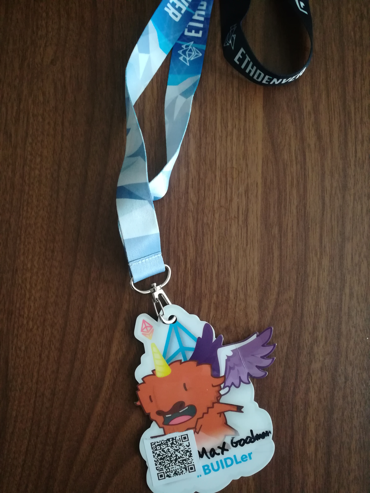
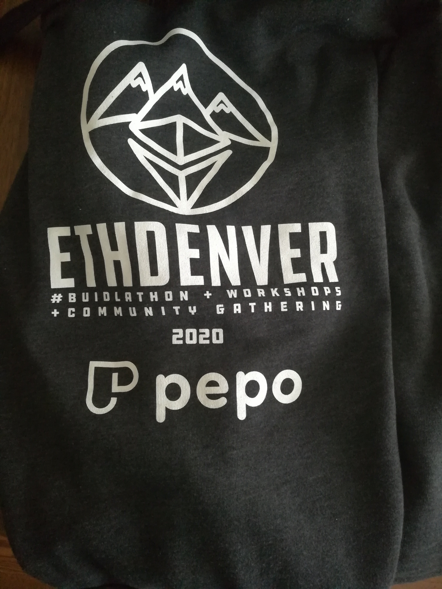

<em>
I just graduated from Consensys Academy Blockchain Developer Bootcamp and am actively searching for funding for my new startup, DeLance, and/or a tech position, preferrably Full Stack, Dapp, or Smart Contract Engineering. I'm flexible for awesome teams with meaningful work.

</em> 
<strong>TLDR;</strong>  ETH Denver was incredibly designed, organized, and executed. You could meet anyone who was anyone in ETH space and make great connections. 
 </em>

## It's The Future: NFTs

After reading about the NFT loan from RocketNFT, ETH Denver was kind enough to offer to cover my accomodation, food, and transport to and from the event. I accepted. So, after coordinating with Simona Pop and ETH Denver team, my RocketNFT loan is almost all paid off from that event except for the interest! Amazing, the power of community caring for it's own. 

## The Journey

I took a Greyhound cross country. It took 1.5 days and I felt like I was vibrating most of the time, even when we were on breaks off of the bus. It was worth it. Greyhound lost my luggage. So, I had no clothes and no toothbrush, etc. Anything I packed was and still is, as of this writing, lost. I spent like 2 hours trying to triage between in person Denver Greyhound support and corporate Greyhound, until finally tweeting out my disappointment. This didn't make much of a difference. They still haven't found my luggage and I'm no longer anywhere close to Denver. 

## The Conference, Itself

There were tons of great tracks: impact track, bounties track, and open track. I decided to go rogue on the conference. By doing this, I met people I wouldn't have otherwise met and was able to sample a bit of each track. It was my first big ETH event and I'm pretty introverted, but was determined to get out of my shell. 

So, I did a lot off the beat track like come up with a new venture idea with Alex from OpenSea and meet my co-founder, Sam. I met members of MetaCartel for the first time. I met a lot of established folks in the industry who welcomed me warmly. I met kind people from Venezuala, New Zealand, etc.  

I didn't know what to expect when I arrived. I knew it would be a large conference, but I didn't realize it would be gamified. I didn't know that 1k+ developers would be inhabiting the 5 floors of the Sports Center on Broadway in Denver to hack on the future of ETH. 

I didn't have as much of a concrete plan and oftentimes found myself overstimulated and fried, as I am a super introverted. Being around so many people interested in similar things is so great. However, I often needed to retreat to my hostel room to take it all in and synthesize what I was experiencing for the first time.  

## Meeting The Person Who Took the Risk On Me

Alex was up on stage at ETH Denver by the time I arrived. I'd seen his picture and was pretty sure it was him atleast. I ended up sitting down next to a member of MetaCartel on a sofa when I first arrived. We chatted and I revealed I used NFTs to get to the conference. They revealed they were in MetaCartel. I still didn't know quite what that meant at the time, but was bullish on DAOs. 
After the panel was over, I think she (whose name I am blanking on I'm bad with names, but good with faces and stories) must have told Alex I was there and what I looked like because next thing I know. I see Alex after having walked away to do something adn come back to the similar spot in the lobby area and there he was, smiling wicked, and we hugged after I introduced myself. 

It was the first time I'd met Alex in person. I'd contacted him on Twitter after reaching out about his mention in EthHub to congratulate him. He was nice enough to respond, but it was a cold DM. The second time I contacted him was to see if he could contribute to me getting to ETH Denver. That's when he said no. BUT he would be willing to give me a loan if I made an NFT and sent it to him. For more on how that went down, check out my previous blog post. 

It was a joy to meet the person who enabled my trip to Denver and a pleasure to learn more about his involvement with MetaGame, MetaCartel and the ETH community in general. 

For all he knew, I could have run away with the money or done something awful with it or reflected poorly on him and MetaCartel and ETH Denver. They all took a great chance on an Internet acquaintance and I'm so grateful for the magic that ensued. 

## The Elusive Hoodie

There were several opportunities for swag. However, I was one of the lucky to recieve the elusive Pepo hoodie during ETH Denver. I did a couple of videos. One on why I love Ethereum and one with a new friend, Tom, who happens to be a part of the Raid Guild. I reported to the booth, then received 2000 pepo and used that to get the hoodie! This was one gamification I couldn't miss out on. 

## Wait, what talks did you go to? 

I would have posted about talks, but I live tweeted the ones I went to and the event was livestreamed. I highly recommend checking those livestreams out and scrolling through my twitter feed if you're interested in the talks that happened at ETH Denver. 

I think this is one of the great things about ETH Denver: all the knowledge is readily accessible. 

## Overall 

Overall, this was an amazing experience and I can't wait to meet more ETH people. I learned a lot about the legal, financial,civic, and social repercussions of decentralization and what the future may look like. It's been a pleasure visualizing the potential routes to a more equitable future with like-minded folks. 

I really hit the lotto with the event, even though I went off the beaten track. 

<strong>I'm looking forward to meeting more like-minded people at EthCC next week</strong>.

## Connect!

Drop me a line, if you're going to EthCC, say hi, especially if you are interested in funding DeLance or hiring!

